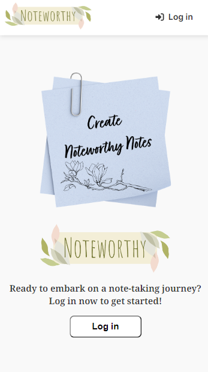
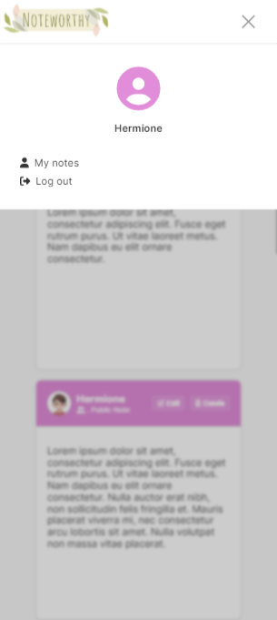
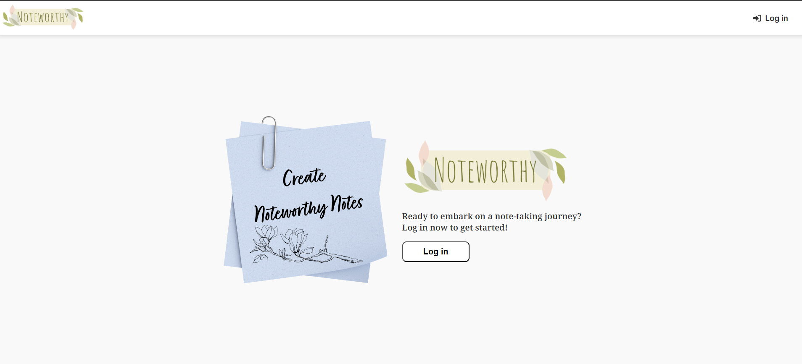
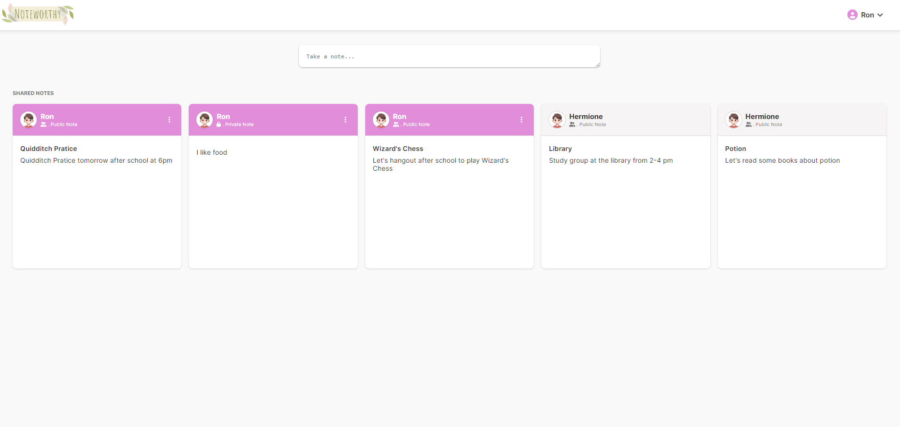

# Noteworthy: A Notetaking-app

> Ready to embark on a note-taking journey? Create `noteworthy notes` with `Noteworthy`. Note is shared among all the users. However, only the note's creator can edit and delete it.

### Recent updates

- Navigation bar context menu (for large screens) issue fixed
- Navigation image logo now has animation on hover to make it clear that you can click and go back to home page
- Navigation bar for mobile version is added
- Context menu is now added to note card to show options for editing, deleting and turn (note) private
- Edit now works inside a modal instead of 'in the note-card itself'
- Edit modal is made responsive

### Currently working on

- Allow a note's creator to make it private
 > The idea is to show the private notes in `MyNotesView` page

### Next I will work on

- Be accessible from a public url

### Tools used

> Frontend

- `Vue 3` used as a Frontend Framework
- `Vue-router` used for routing
- `Pinia` used for managing global states
- `Vanilla CSS` used for styling
- `Font awesome` used for icons

> Backend

- `Node.js`
- `Express.js`
- `MongoDB (cloud)`

### Responsive Design

- The website is responsive and it works on all devices
  > Here, you can see examples for `small` and `large` screens
  >
  >  >  
  >  > 

### Functionalities

- Requires a login to access
- It allows for more than one user. Each user have a username and an individual password
- The app allows the user to create and read notes
- Created notes are saved and retrieved on next visit
- It shows which user created a note
- It allows only note's creator to edit and delete it

### Links used

- [Adobe express](https://new.express.adobe.com/) used for creating logo
- [css-box-shadow-examples](https://getcssscan.com/css-box-shadow-examples) used for Box-shadow
- [font awesome](https://fontawesome.com/) used for icons
- [Microsoft copilot](https://copilot.microsoft.com/) used to generate animated drawings
- [animista](https://animista.net/), CSS animations library, used for animations

### Final Notes

> It was really fun working on this project. Even though the final design is my own, I did took a lot of inspiration from [Google keep](https://keep.google.com/), [Dribbble](https://dribbble.com/) and [Facebook Posts](https://www.facebook.com/).

### Opening/ Running the file

#### Backend

> `npm run dev` or `npm run start`

#### Frontend

> `npm run dev`

#### Log in via these Accounts
You can log in using 3 different accounts to test the project:
| Username | Password |
|-----------------|-----------------|
| `Harry` | `Harry1` |
| `Ron` | `Ron1` |
| `Hermione` | `Hermione1` |

