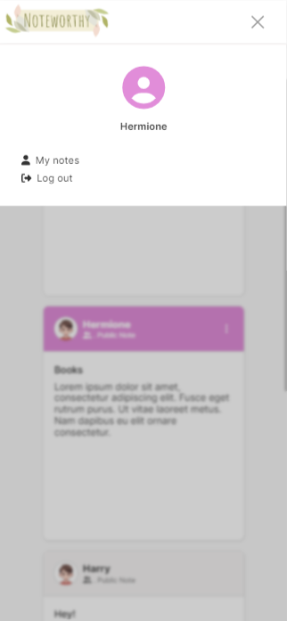

# Noteworthy: A Notetaking-app

> Ready to embark on a note-taking journey? Create `noteworthy notes` with `Noteworthy`. The note is shared among all the users. However, only the note's creator can edit, delete, or make the note private.

https://github.com/ShivaniKhatri96/Notetaking-app/assets/48630686/f66bc6c8-77c2-4f05-92fe-5506c754c0c2

### Tools used

> Frontend

- `Vue 3` used as a Frontend Framework
- `Vue-router` used for routing
- `Pinia` used for managing global states
- `Vanilla CSS` used for styling
- `Font awesome` used for icons

> Backend

- `Node.js`
- `Express.js`
- `MongoDB (cloud)`

### Responsive Design

- The website is responsive and it works on all devices
  > Here, you can see examples of `small` and `large` screens
  >
  >  >  
  >  > 

### Functionalities

- Requires a login to access
- It allows for more than one user. Each user has a username and an individual password
- The app allows the user to create and read notes
- Created notes are saved and retrieved on the next visit
- It shows which user created a note
- It allows only the note's creator to edit and delete it
- A note's creator is also allowed to make their note private which means other users can't see it

### Future Goal
- Be accessible from a public URL by deploying. Right now only accessible using localhost

### Links used

- [Adobe express](https://new.express.adobe.com/) used for creating logo
- [css-box-shadow-examples](https://getcssscan.com/css-box-shadow-examples) used for Box-shadow
- [font awesome](https://fontawesome.com/) used for icons
- [Microsoft copilot](https://copilot.microsoft.com/) used to generate animated drawings
- [animista](https://animista.net/), CSS animations library, used for animations

### Opening/ Running the file

#### Backend

> `npm run dev` or `npm run start`

#### Frontend

> `npm run dev`

#### Log in via these Accounts
You can log in using 3 different accounts to test the project:
| Username | Password |
|-----------------|-----------------|
| `Hermione` | `Hermione1` |
| `Ron` | `Ron1` |
| `Harry` | `Harry1` |

### Final Notes

> There are some notes already created in Hermione's and Ron's accounts but I have intentionally left Harry's account empty to show the difference. 
> It was really fun working on this project. Even though the final design is my own, I took a lot of inspiration from [Google keep](https://keep.google.com/), [Dribbble](https://dribbble.com/) and [Facebook Posts](https://www.facebook.com/).

